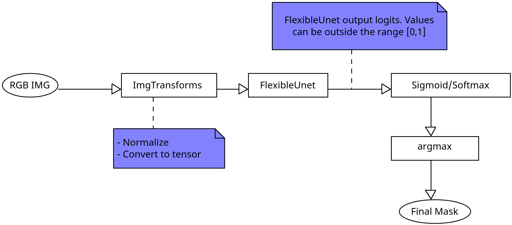

# Deep learning model notes

The package `surg_sec` utilizes the model `FlexibleUnet` from [Monai zoo][1]. When building scripts for this model, it is important to keep in mind that the model final layers is convolutional and therefore the output are not probabilities. To convert the output of the model a to a probablility you need to apply the sigmoid of softmax function.

A common workflow for using the model is the following:

    

[//]: # (Link sections)

[1]: https://github.com/Project-MONAI/model-zoo/tree/dev/models/endoscopic_tool_segmentation